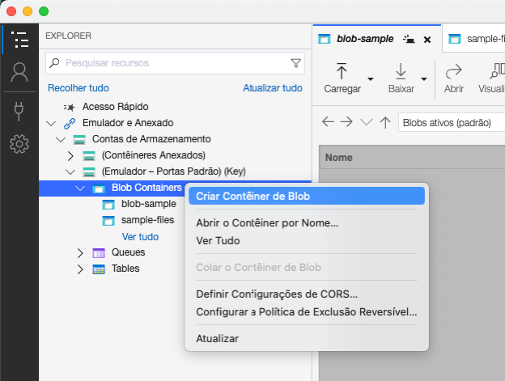
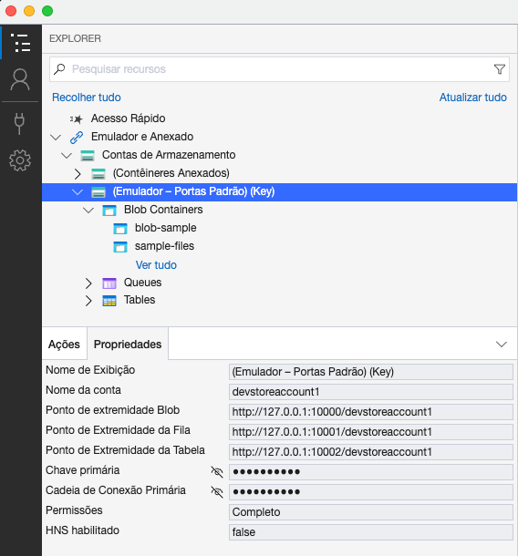

# azure-blob-sample

Spring Boot project to create and download files with Azure Blob Storage in a local environment

## How to run

1. Enter on docker folder and run docker compose to start Azurite (A lightweight server clone of Azure Storage):
```
cd ./docker/
docker-compose up
```

# azure-blob-sample

Spring Boot project to create and download files with Azure Blob Storage in a local environment

### Stack
- Java 21
- Spring Boot 3.3
- Docker Compose
- Azure Blob Storage

### Getting started
1. Run the [docker-compose.yml](./docker/docker-compose.yml) file to start Azurite (A lightweight server clone of Azure Storage).
2. Import postman collection [azure-blob-sample-collection.json](./postman/azure-blob-sample-collection.json) to help with the requests.
3. Download [Microsoft Azure Storage Explorer](https://azure.microsoft.com/en-us/products/storage/storage-explorer) to interact with blob containers and it's files.
4. Configure an Azure Blob container in the Microsoft Azure Storage Explorer*.
5. Update the [application.yml](./src/main/resources/application.yml) file with the new container's name and the account storage properties**.  
6. Run the application.
   1. The SampleDataInitializer will create a file 'yellowstone-family-members.csv'.
   2. You can upload files, download files with extension pattern and list the files names from your Azure Blob Container using the postman requests. 
 
### Config the Azure Blob Storage*

1. In the Microsoft Azure Storage Explorer, create a Blob Container in the emulator storage account menu.



### Check the Azure Storage account properties** 

1. Click on 'Emulator Default' and then 'Properties' to see the account properties.

